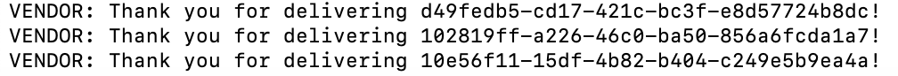

# caps-vendor
An event based app that is a socket client for the CAPS socket server app. This app services the vendors, the app broadcasts to the CAPS management when packages are ready to be picked up and responds to delivered packages with a thank you message.

## Author: Anne Thorsteinson

**[Tests](https://github.com/AnneThor/caps-vendor/actions)**

**[Front End - UNDER CONSTRUCTION](https://parcel-delivery-tracker.herokuapp.com/)**

## Setup

```.env``` requirements:

- ```PORT```
- ```STORE_ID```: this can be hard coded, or used to determine the

## Running the App

Currently working on the backend, so there is no front end display yet

- ```npm start```: this will run the app, it will listen for events from the CAPS server app and respond accordingly

- When a vendor joins the connection, they join a room named by their ```STORE_ID``` variable allowing them to receive direct messages from the CAPS server in that space
- Vendor emits packages when they are ready to be delivered to the CAPS app to connect to drivers
- Vendors received messages from CAPS when their packages are delivered and they respond with a thank you message
- The vendor app logs the below to the console
-



### Endpoints:

The app runs from the ```/caps``` namespace

## Tests

- Unit Tests: ```npm run test``` testing is complete for listener functions
- Lint Tests: ```npm run lint```

## UML Diagram


